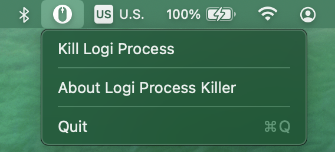

# Logi Process Killer

  

## Motivation

Everytime when I switch my MX master from my work laptop to my MacBook, or when I wake my MacBook from sleep mode, somehow the mapped keys are not working anymore.

  

Forward/backward buttons are not working, predefined mouse gestures are not recognized.

I would have to go in Activity Monitor, type and search the process, kill it, to make it to work again, which is easy but it is just annoying to deal with every time.

  

As a developer, why don't make it easier? Place a button where I can always access it and kill it with 1 click, no more opening Activity Monitor, no more typing and searching for the same process every time.

Just 1 click to kill.

Automate it whenever possible, otherwise, time is wasted.

## Description

macOS: 12.3+

I created a menu bar application so that it can be accessed and kill the `Logi Options Daemon` process easily.

  

This Logi Process Killer is to kill the Daemon of `Logi Options`

> [`Logi Options`](https://www.logitech.com/en-hk/software/options.html) a powerful and easy-to-use application that enhances your Logitech mice, keyboards, and touchpads. Customize your device with Options to achieve more, faster. 

> 

Why do I not need to launch the `Logi Options Daemon` again? Because it will automatically boot up itself after being killed

  

Features

- Kill `Logi Options Daemon` - a notification will appear to inform the user whether the process has successfully killed or not
- Launch at Login - everytime you restart, you won't need to launch it manually

### Success notification

  

### Fail notification

  

